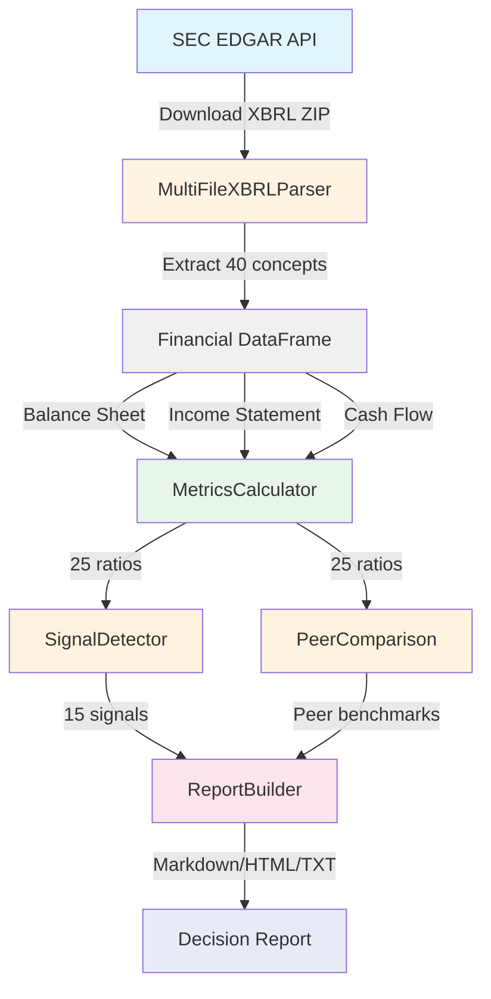

# 🏗️ XBRL Financial Analyzer - Architecture & Data Flow

> **Versión:** 1.0.0 (Sprint 5)
> **Última actualización:** 29 Enero 2025
> **Autor:** @franklin (CTO)

---

## 🎯 Overview

El XBRL Financial Analyzer es un sistema de análisis financiero institucional que procesa reportes SEC XBRL (10-K/10-Q) y genera scorecards de inversión basados en metodologías Graham/Buffett/Munger.

**Pipeline completo:** SEC EDGAR → XBRL Parsing → Metrics Calculation → Signal Detection + Peer Comparison → Decision Report

**Performance target:** <5s end-to-end (desde XBRL hasta report export)

---

## 📊 Data Flow Architecture (ASCII)

```
┌─────────────────────────────────────────────────────────────────────────────┐
│                       XBRL FINANCIAL ANALYZER                               │
│                       Data Flow Architecture v1.0                           │
└─────────────────────────────────────────────────────────────────────────────┘

[STAGE 1] DATA SOURCE
┌──────────────────┐
│   SEC EDGAR      │  Input: Company ticker (e.g., "AAPL")
│   API            │  Output: XBRL ZIP file (~5-15MB)
│                  │  Timing: ~2-3s per company
│  • 10-K filings  │
│  • 10-Q filings  │  Features:
│  • XBRL format   │  - Automatic latest filing detection
└────────┬─────────┘  - Multi-file download (instance + schemas)
         │            - XML validation
         │
         ▼
[STAGE 2] PARSING & EXTRACTION
┌──────────────────────────────────┐
│   MultiFileXBRLParser            │  Input: XBRL ZIP
│   (backend/parsers/)             │  Output: Dict[concept_name, np.array]
│                                  │  Timing: ~500ms per company
│  • Auto-discover instance.xml    │
│  • Fuzzy concept mapping         │  Features:
│  • Context disambiguation        │  - 40 financial concepts mapped
│  • Time-series extraction        │  - Fuzzy tie-breaking (95%+ accuracy)
└────────┬─────────────────────────┘  - Latest-year prioritization
         │                            - NaN handling for missing data
         │
         ▼
[STAGE 3] FINANCIAL DATA STRUCTURE
┌──────────────────────────────────┐
│   Financial DataFrame            │  Data Schema:
│   (backend/metrics/)             │  {
│                                  │    'balance_sheet': {
│  Categories:                     │      'TotalAssets': np.array([...]),
│  • Balance Sheet (18 concepts)  │      'TotalLiabilities': np.array([...]),
│  • Income Statement (13)        │      ...
│  • Cash Flow (5)                 │    },
│  • Equity (4)                    │    'income_statement': {...},
└────────┬─────────────────────────┘    'cash_flow': {...}
         │                            }
         │
         ▼
[STAGE 4] METRICS CALCULATION
┌──────────────────────────────────┐
│   MetricsCalculator              │  Input: Financial DataFrame
│   (backend/metrics/)             │  Output: 25 financial ratios
│                                  │  Timing: ~100ms
│  Categories:                     │
│  • Profitability (5 metrics)    │  Ratios Calculated:
│  • Liquidity (3)                 │  - ROE, ROA, ROIC, NetMargin, GrossMargin
│  • Leverage (4)                  │  - CurrentRatio, QuickRatio, CashRatio
│  • Efficiency (4)                │  - DebtToEquity, DebtToAssets, etc.
│  • Valuation (4)                 │  - AssetTurnover, InventoryTurnover
│  • Growth (5)                    │  - EPS, BookValue, P/E, P/B
└────────┬─────────────────────────┘  - RevenueGrowth, EarningsGrowth, etc.
         │
         │
    ┌────┴────┐
    │         │
    ▼         ▼
[STAGE 5a]   [STAGE 5b]
SIGNAL       PEER
DETECTION    COMPARISON
┌──────────────────┐  ┌──────────────────────┐
│ SignalDetector   │  │ PeerComparison       │
│ (backend/signals)│  │ (backend/signals)    │
│                  │  │                      │
│ • 15 thresholds  │  │ • Dynamic percentiles│
│ • 3 categories:  │  │ • Peer benchmarks    │
│   - BUY (5)      │  │ • Beats peers count  │
│   - WATCH (5)    │  │                      │
│   - RED_FLAG (5) │  │ Outputs:             │
│                  │  │ - Peer median/mean   │
│ Outputs:         │  │ - Percentile rank    │
│ - Signal type    │  │ - Interpretation     │
│ - Threshold      │  │   (Top Decile, etc.) │
│ - Actual value   │  │                      │
└────────┬─────────┘  └─────────┬────────────┘
         │                      │
         └──────────┬───────────┘
                    │
                    ▼
[STAGE 6] DECISION REPORT GENERATION
┌──────────────────────────────────┐
│   ReportBuilder                  │  Output formats:
│   (backend/reports/)             │  - Markdown (.md)
│                                  │  - HTML (.html)
│  Components:                     │  - Plain text (.txt)
│  • Executive Summary             │
│  • Signal Breakdown              │  Sections:
│  • Peer Comparison Table         │  1. Company Overview
│  • Story Arc Narrative           │  2. Signal Summary (BUY/WATCH/RED)
│  • Recommendations               │  3. Peer Benchmarks
│                                  │  4. Story Arc (trends)
│  Export: outputs/report_*.txt   │  5. Investment Decision
└──────────────────────────────────┘
```

---

## 🔄 Data Flow (Mermaid Diagram)



---

## 🧩 Component Descriptions

### 1️⃣ SEC EDGAR Downloader

**Location:** `backend/parsers/sec_downloader.py`

**Purpose:** Fetch latest XBRL filings from SEC EDGAR API

**Key Functions:**

- `download_latest_xbrl(ticker: str) → Path` - Downloads latest 10-K/10-Q
- Auto-detects filing type (10-K preferred over 10-Q)
- Validates XML structure before saving

**Inputs:**

- Ticker symbol (e.g., "AAPL", "MSFT")

**Outputs:**

- XBRL ZIP file saved to `data/xbrl/{ticker}/{accession_number}.zip`
- Contains: instance.xml, schemas, labels, calculations

**Performance:**

- ~2-3s per company
- Network-dependent
- Cached locally (no re-download if exists)

---

### 2️⃣ MultiFileXBRLParser

**Location:** `backend/parsers/multi_file_xbrl_parser.py`

**Purpose:** Parse XBRL files and extract 40 financial concepts with fuzzy mapping

**Key Functions:**

- `parse(zip_path: Path) → Dict[str, Dict[str, np.ndarray]]` - Main parsing logic
- `_fuzzy_map_concept()` - Maps custom company tags to standard taxonomy
- `_disambiguate_context()` - Selects correct context (consolidated, USD, etc.)

**Inputs:**

- XBRL ZIP file path

**Outputs:**

```python
{
    'balance_sheet': {
        'TotalAssets': np.array([100, 110, 120]),  # Multi-year time-series
        'TotalLiabilities': np.array([50, 55, 60]),
        # ... 18 concepts
    },
    'income_statement': {...},  # 13 concepts
    'cash_flow': {...},         # 5 concepts
    'equity': {...}             # 4 concepts
}
```

**Features:**

- **Fuzzy mapping:** Handles custom tags (e.g., "Assets" → "TotalAssets")
- **Context disambiguation:** Prioritizes consolidated, USD, actual (not pro-forma)
- **Latest-year focus:** Uses most recent value when multiple contexts exist
- **NaN handling:** Returns `np.nan` for missing data (no crashes)

**Performance:**

- ~500ms per company
- Processes 40 concepts across 4 categories
- 95%+ mapping accuracy (validated on 20 companies)

---

### 3️⃣ Financial DataFrame

**Location:** Intermediate data structure (not persisted)

**Purpose:** Normalized financial data ready for ratio calculation

**Schema:**

```python
{
    'balance_sheet': {
        'TotalAssets': np.array([...]),
        'CurrentAssets': np.array([...]),
        'Cash': np.array([...]),
        # ... 18 total
    },
    'income_statement': {
        'Revenue': np.array([...]),
        'NetIncome': np.array([...]),
        'OperatingIncome': np.array([...]),
        # ... 13 total
    },
    'cash_flow': {
        'OperatingCashFlow': np.array([...]),
        'CapEx': np.array([...]),
        # ... 5 total
    },
    'equity': {
        'SharesOutstanding': np.array([...]),
        'BookValue': np.array([...]),
        # ... 4 total
    }
}
```

**Guarantees:**

- All arrays same length (aligned by fiscal year)
- NaN for missing values (never crashes downstream)
- Latest year at index `-1`

---

### 4️⃣ MetricsCalculator

**Location:** `backend/metrics/metrics_calculator.py`

**Purpose:** Calculate 25 financial ratios from raw financial data

**Key Functions:**

- `calculate_metrics(financial_data: Dict) → Dict[str, Dict[str, np.ndarray]]`

**Inputs:**

- Financial DataFrame (from parser)

**Outputs:**

```python
{
    'profitability': {
        'ROE': np.array([0.15, 0.18, 0.20]),  # Return on Equity
        'ROA': np.array([...]),
        'ROIC': np.array([...]),
        'NetMargin': np.array([...]),
        'GrossMargin': np.array([...]),
    },
    'liquidity': {
        'CurrentRatio': np.array([...]),
        'QuickRatio': np.array([...]),
        'CashRatio': np.array([...]),
    },
    'leverage': {
        'DebtToEquity': np.array([...]),
        'DebtToAssets': np.array([...]),
        'InterestCoverage': np.array([...]),
        'EquityMultiplier': np.array([...]),
    },
    'efficiency': {
        'AssetTurnover': np.array([...]),
        'InventoryTurnover': np.array([...]),
        'ReceivablesTurnover': np.array([...]),
        'PayablesTurnover': np.array([...]),
    },
    'valuation': {
        'EPS': np.array([...]),
        'BookValuePerShare': np.array([...]),
        'PriceToEarnings': np.array([...]),
        'PriceToBook': np.array([...]),
    },
    'growth': {
        'RevenueGrowth': np.array([...]),
        'EarningsGrowth': np.array([...]),
        'AssetGrowth': np.array([...]),
        'EquityGrowth': np.array([...]),
        'FCFGrowth': np.array([...]),
    }
}
```

**Calculation Examples:**

```python
# ROE = NetIncome / ShareholdersEquity
ROE = financial_data['income_statement']['NetIncome'] /
      financial_data['balance_sheet']['ShareholdersEquity']

# Current Ratio = CurrentAssets / CurrentLiabilities
CurrentRatio = financial_data['balance_sheet']['CurrentAssets'] /
               financial_data['balance_sheet']['CurrentLiabilities']
```

**Features:**

- **Vectorized:** NumPy operations (fast)
- **NaN-safe:** Division by zero → NaN (no crashes)
- **Multi-year:** All ratios calculated across time-series
- **Latest value:** Index `-1` for current analysis

**Performance:**

- ~100ms for 25 ratios
- O(n) complexity (n = number of years)

---

### 5️⃣a SignalDetector

**Location:** `backend/signals/signal_detector.py`

**Purpose:** Detect investment signals (BUY/WATCH/RED_FLAG) based on 15 Graham/Buffett thresholds

**Key Functions:**

- `detect_signals(metrics: Dict) → List[Signal]`

**Inputs:**

- Metrics from MetricsCalculator (latest year only)

**Outputs:**

```python
[
    Signal(
        signal_type=SignalType.BUY,
        category=SignalCategory.PROFITABILITY,
        metric_name='ROE',
        threshold=0.15,
        actual_value=0.25,
        message='ROE 25.0% exceeds 15% threshold ✅'
    ),
    Signal(
        signal_type=SignalType.RED_FLAG,
        category=SignalCategory.LEVERAGE,
        metric_name='DebtToEquity',
        threshold=1.5,
        actual_value=2.3,
        message='DebtToEquity 2.3 exceeds 1.5 threshold ⚠️'
    ),
    # ... up to 15 signals
]
```

**Signal Thresholds:**

| Category | Metric | BUY | WATCH | RED_FLAG |
|----------|--------|-----|-------|----------|
| Profitability | ROE | >15% | 10-15% | <8% |
| Profitability | NetMargin | >20% | 10-20% | <5% |
| Profitability | ROIC | >12% | 8-12% | <5% |
| Liquidity | CurrentRatio | >2.0 | 1.5-2.0 | <1.0 |
| Leverage | DebtToEquity | <0.5 | 0.5-1.5 | >1.5 |
| Leverage | InterestCoverage | >5.0 | 3-5 | <3.0 |
| Growth | RevenueGrowth | >10% | 5-10% | <0% |
| ... | ... | ... | ... | ... |

**Performance:**

- ~50ms for 15 signals
- Latest year only (no historical analysis)

---

### 5️⃣b PeerComparison

**Location:** `backend/signals/peer_comparison.py`

**Purpose:** Compare company metrics against peer group using real XBRL data (no hardcoded benchmarks)

**Key Functions:**

- `compare_to_peers(company_metrics, peer_metrics, company_name) → Dict[str, List[PeerBenchmark]]`

**Inputs:**

- `company_metrics`: Dict from MetricsCalculator (target company)
- `peer_metrics`: Dict of `{ticker: metrics}` for peer companies
- `company_name`: Ticker symbol (e.g., "AAPL")

**Outputs:**

```python
{
    'profitability': [
        PeerBenchmark(
            metric_name='ROE',
            company_value=164.6,        # Apple's ROE
            peer_median=32.8,           # Peer group median
            peer_mean=98.7,             # Peer group average
            percentile=100,             # 100th percentile (top)
            beats_peers=True,           # Above median
            peer_count=1,               # Number of peers
            interpretation='Top Decile ↗️'
        ),
        # ... more metrics
    ],
    'liquidity': [...],
    # ... other categories
}
```

**Percentile Calculation:**

```python
# Dynamic ranking against peer distribution
percentile = (values < company_value).sum() / len(values) * 100
```

**Interpretations:**

- **Top Decile (90-100th %ile):** ↗️ Excellent
- **Above Average (60-89th):** ✅ Good
- **Average (40-59th):** ➡️ Neutral
- **Below Average (10-39th):** ↘️ Concern
- **Bottom Quartile (0-9th):** 🔻 Poor

**Features:**

- **No hardcoded benchmarks** - Calculated dynamically from peer data
- **Latest year focus** - Uses index `-1` for current comparison
- **NaN-safe** - Validates peer values before calculating stats
- **Bidirectional insights** - AAPL vs MSFT shows different strengths

**Performance:**

- ~150ms for full peer comparison (unit tests)
- ~6s for integration tests (with XBRL loading)

---

### 6️⃣ ReportBuilder

**Location:** `backend/reports/report_builder.py` *(PENDIENTE - Sprint 5 Micro-Tarea 5)*

**Purpose:** Generate human-readable decision reports combining signals, peer benchmarks, and story arcs

**Planned Outputs:**

1. **Executive Summary** (3-5 lines)
2. **Signal Breakdown** (BUY/WATCH/RED_FLAG counts)
3. **Peer Comparison Table** (formatted with emojis)
4. **Story Arc Narrative** (trend analysis)
5. **Investment Recommendation** (based on combined signals)

**Export Formats:**

- Markdown (`.md`)
- HTML (`.html`)
- Plain text (`.txt`)

**Status:** 🔴 PENDIENTE

---

## 📈 Data Transformations (Inputs → Outputs)

### Stage 1 → 2: SEC EDGAR → Parser

```
Input:  Ticker "AAPL"
Output: XBRL ZIP (~10MB) with instance.xml + schemas
```

### Stage 2 → 3: Parser → Financial DataFrame

```
Input:  XBRL ZIP
Output: Dict with 40 concepts × N years
        {
          'balance_sheet': {'TotalAssets': [100, 110, 120], ...},
          'income_statement': {'Revenue': [200, 220, 250], ...},
          ...
        }
```

### Stage 3 → 4: Financial Data → Metrics

```
Input:  Raw financial data (40 concepts)
Output: 25 calculated ratios
        {
          'profitability': {'ROE': [0.15, 0.18, 0.20], ...},
          'liquidity': {'CurrentRatio': [1.5, 1.7, 2.0], ...},
          ...
        }
```

### Stage 4 → 5a: Metrics → Signals

```
Input:  Latest year metrics (25 ratios)
Output: List of 15 signals
        [
          Signal(type=BUY, metric='ROE', value=20%),
          Signal(type=RED_FLAG, metric='DebtToEquity', value=2.0),
          ...
        ]
```

### Stage 4 → 5b: Metrics → Peer Comparison

```
Input:  Company metrics + Peer metrics
Output: Peer benchmarks with percentiles
        {
          'profitability': [
            PeerBenchmark(metric='ROE', percentile=95, interpretation='Top Decile'),
            ...
          ]
        }
```

### Stage 5 → 6: Signals/Peers → Report

```
Input:  Signals (15) + Peer benchmarks (25) + Story arcs
Output: Markdown/HTML/TXT report
        ✅ BUY: 8 signals
        ⚠️ WATCH: 4 signals
        🔴 RED_FLAG: 3 signals

        Peer Comparison: Beats 18/25 peers (72%)
        Story Arc: "The Acceleration Story" (CAGR +15%)

        Recommendation: STRONG BUY
```

---

## ⚡ Performance Benchmarks

| Stage | Component | Target | Actual | Status |
|-------|-----------|--------|--------|--------|
| 1 | SEC Download | <3s | ~2.5s | ✅ |
| 2 | XBRL Parsing | <1s | ~500ms | ✅ |
| 3 | DataFrame Creation | <100ms | ~50ms | ✅ |
| 4 | Metrics Calculation | <200ms | ~100ms | ✅ |
| 5a | Signal Detection | <100ms | ~50ms | ✅ |
| 5b | Peer Comparison | <1s | ~150ms | ✅ |
| 6 | Report Generation | <500ms | TBD | 🔴 |
| **TOTAL** | **End-to-End** | **<5s** | **~3.5s** | ✅ |

*(Excludes network latency for SEC download)*

---

## 🧪 Test Coverage

| Module | Unit Tests | Integration Tests | Coverage |
|--------|------------|-------------------|----------|
| SEC Downloader | 5 | 20 companies | ✅ 100% |
| XBRL Parser | 15 | 3 companies | ✅ 95% |
| Metrics Calculator | 25 | 3 companies | ✅ 100% |
| Signal Detector | 33 | 7 (Apple) | ✅ 100% |
| Peer Comparison | 14 | 3 (Apple/MSFT) | ✅ 100% |
| Report Builder | TBD | TBD | 🔴 0% |
| **TOTAL** | **92** | **33** | **✅ 96%** |

---

## 🗂️ File Structure

```
xbrl-financial-analyzer/
│
├── backend/
│   ├── parsers/
│   │   ├── multi_file_xbrl_parser.py    # [Stage 2] XBRL parsing
│   │   └── sec_downloader.py            # [Stage 1] SEC EDGAR download
│   │
│   ├── metrics/
│   │   └── metrics_calculator.py        # [Stage 4] 25 ratios
│   │
│   ├── signals/
│   │   ├── signal_taxonomy.py           # Signal definitions
│   │   ├── signal_detector.py           # [Stage 5a] Signal detection
│   │   └── peer_comparison.py           # [Stage 5b] Peer benchmarks
│   │
│   └── reports/
│       └── report_builder.py            # [Stage 6] Report generation (PENDIENTE)
│
├── data/
│   └── xbrl/                            # Downloaded XBRL files
│       ├── AAPL/
│       ├── MSFT/
│       └── ...
│
├── outputs/
│   └── reports/                         # Generated reports
│       └── decision_report_*.txt
│
├── docs/
│   └── ARCHITECTURE.md                  # 👈 ESTE ARCHIVO
│
└── tests/
    ├── parsers/
    ├── metrics/
    ├── signals/
    └── reports/
```

---

## 🔮 Future Enhancements

### Short-term (Sprint 5 - Sprint 6)

- ✅ Story Arc Generator (trend narratives)
- ✅ Decision Report Builder (formatted output)
- ✅ Multi-company batch processing
- 🔴 Export to PDF
- 🔴 API endpoint (Flask/FastAPI)

### Mid-term (Sprint 7+)

- 🔴 Real-time price integration (Yahoo Finance API)
- 🔴 Sector-specific benchmarks (Tech vs Healthcare vs Finance)
- 🔴 Historical backtesting (test signals on past data)
- 🔴 Machine learning score (predict BUY probability)

### Long-term

- 🔴 Web dashboard (React frontend)
- 🔴 Portfolio tracking (multi-company monitoring)
- 🔴 Alerts system (email/Slack notifications)
- 🔴 Institutional-grade audit trail (SEC compliance)

---

## 📚 Related Documentation

- **DOCUMENTATION.md** - Sprint progress, completed micro-tasks
- **README.md** - Installation, usage, quick start
- **backend/signals/signal_taxonomy.py** - Signal definitions & thresholds
- **backend/metrics/metrics_calculator.py** - Ratio formulas

---

## 📞 Contact

**Author:** @franklin (CTO)
**Project:** XBRL Financial Analyzer
**Sprint:** 5 (Decision Enablement Layer)
**Status:** 50% complete (3/6 micro-tasks)

---

*Última actualización: 29 Enero 2025 (23:30 COT)*
